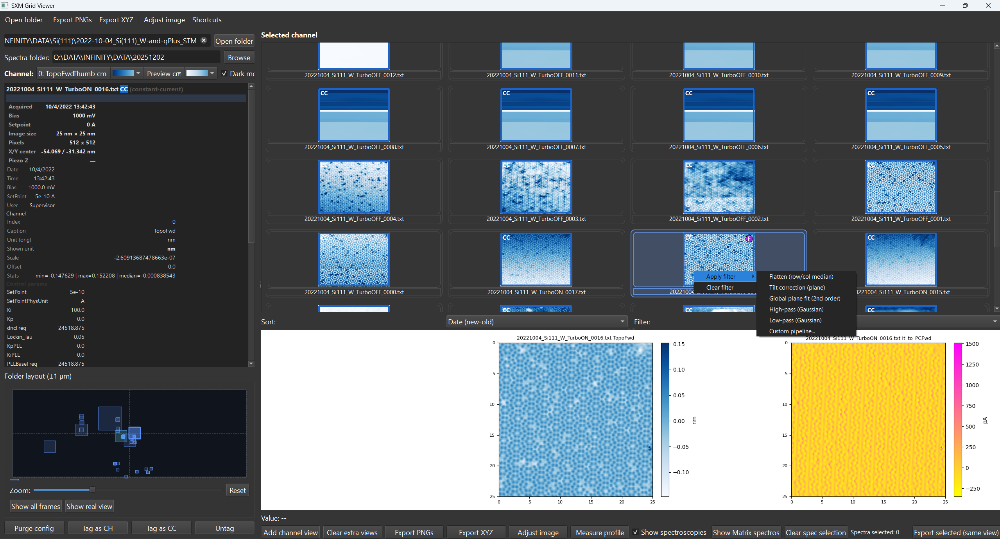
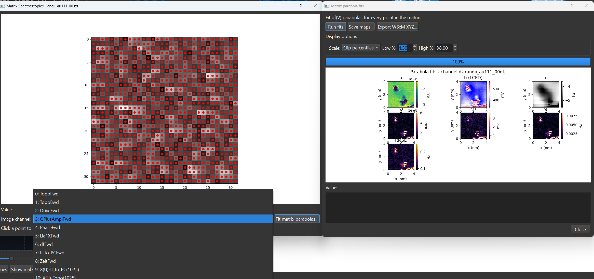
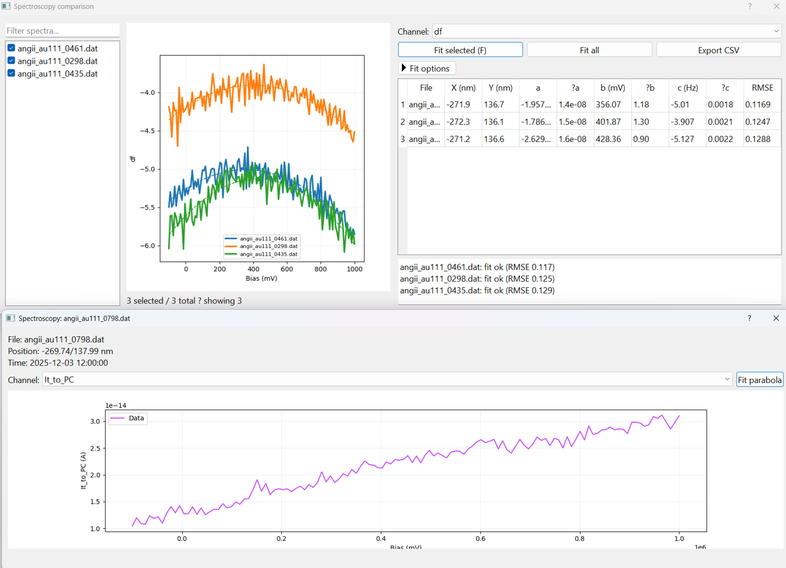

# SXM Grid Viewer

This viewer is tuned for data acquired with an Anfatec SXM controller running an Omicron Infinity microscope (tribus head, QPlus sensors at 8.6 K). It started life as a single monolithic script; it is now split into modules for the GUI, thumbnail grid, minimap, and helpers so it stays maintainable and easy to install.

## Screenshots (quick tour)

All images live in `screenshots/` so you can see the workflow before loading your own data.





## Why this exists

- Replaces a bulky one-off script with a repeatable install that lab PCs can keep in sync.
- Makes it fast to browse large folders, spot constant-height frames, and keep dz tags attached.
- Keeps spectroscopy, matrix scans, parabola fits, and WSxM XYZ exports in one place instead of scattered tools.
- Gives new users a predictable launcher and keeps the environment self contained in `.venv`.

## What it solves

- Thumbnail grid plus minimap to scan folders without blocking on full renders.
- Automatic detection of constant-height/current frames with dz preserved per file.
- Spectroscopy panel for single traces, matrix scans, parabola fits, and XYZ export (still being refined, so expect updates).
- Legacy `sxm_grid_viewer.py` remains as a shim; it now imports the package entry point.

## Install and run

1) Clone or unzip the repo and work from the folder that contains `install.py`.
2) Create the environment and install dependencies (Python 3.9–3.12 recommended):
   ```
   python install.py          # add --reset to rebuild .venv from scratch
   ```
   - Prefer double-clicking? `install_sxm_viewer.bat` picks a working interpreter (`PYTHON` env, `.venv`, Conda, `py -3`, then PATH) and runs the same script.
   - The installer builds a fresh `.venv` and now honours a `PYTHON` path if you need a specific interpreter.
3) Launch the viewer:
   ```
   python -m sxm_viewer
   ```
   - Shortcut for lab PCs: `run_sxm_viewer.bat` auto-selects the local env and validates imports before launching.
   - Alternate entry points: `python -m sxm_viewer.cli` or `python sxm_grid_viewer.py`.

## Notes

- Re-run `python install.py` when dependencies change; add `--reset` if the existing `.venv` is broken.
- Set `PYTHON` (or pass `--python`) before running the installer to force a specific interpreter.
- Spectroscopy handling is under active improvement; workflows there may evolve.

## License

MIT License (see `LICENSE`).
