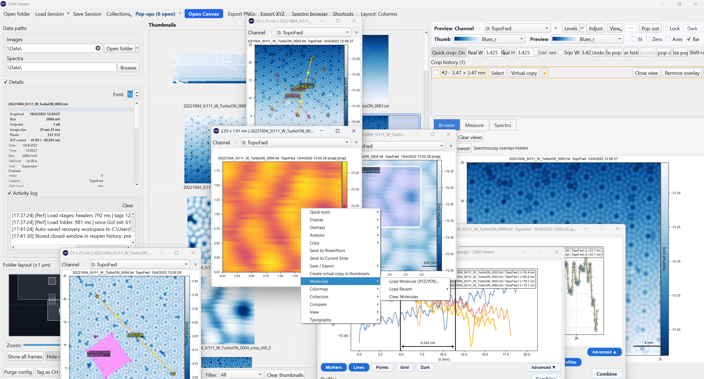
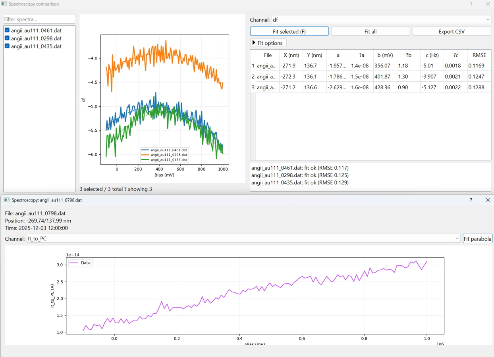

# SXM Viewer

Fast thumbnail browsing, spectroscopy overlays, and publication-ready canvases
for Omicron/Anfatec data. Nanonis `.sxm` files are supported through the bundled
adapter (they are converted into Omicron-style headers on load).

## Gallery (animated)
- Wheel zoom + pan + reset
  
- Crop -> pop-out -> measure
  
- Thumbnail to pop-out
  
- Histogram live contrast
  
- Filters pipeline
  
- Spectro workflow
  
- Molecular overlay styling
  
- Canvas export flow
  

Static reference:




## Installation
Start in the repository root (`sxm_viewer/`). Supported Python versions are
3.8 to 3.13.

If you do not already have Python, install it from
https://www.python.org/downloads/ and prefer the standard python.org build on
Windows. That is the lowest-friction option for this project.

This project is launched from this repository checkout. Keep the repo folder and
run the viewer from there rather than expecting a global `sxm_viewer` command.

### Option 1: Windows, easiest path
If you just want the app working with the least setup:

1. Download or clone this repository.
2. Open the `scripts` folder.
3. Double-click `install_sxm_viewer.bat`.
4. When installation finishes, double-click `run_sxm_viewer.bat`.

What this does:
- Creates `scripts/.venv`
- Installs everything from `scripts/requirements.txt`
- Launches the viewer with the local virtual environment

### Option 2: Standard Python terminal workflow
Use this if you already use Python but do not want to manage dependencies in
your global interpreter.

From the repository root:

```powershell
python scripts/install.py
```

Then launch with the repo-managed environment:

```powershell
scripts\run_sxm_viewer.bat
```

If you want to stay in the terminal instead of using the BAT launcher:

```powershell
scripts\.venv\Scripts\python.exe -m sxm_viewer
```

If `python` is not the right command on your machine, use the Windows launcher
to run the installer:

```powershell
py -3 scripts/install.py
```

To rebuild the bundled virtual environment from scratch:

```powershell
python scripts/install.py --reset
```

### Option 3: Existing Conda environment
If you prefer Conda, create or activate an environment first, then install the
requirements into that environment.

```powershell
conda create -n sxm_viewer python=3.11
conda activate sxm_viewer
pip install -r scripts/requirements.txt
python -m sxm_viewer
```

Notes for Conda users:
- Python 3.10 or 3.11 is a safe choice.
- Launch from the repository root so `python -m sxm_viewer` can import the package.
- If your Conda Python has SSL problems, run `conda install openssl certifi` or
  use the python.org installer instead.

### Option 4: Existing venv or system Python
If you already have an activated virtual environment and want to use it:

```powershell
pip install -r scripts/requirements.txt
python -m sxm_viewer
```

This skips the repo-managed `.venv` and installs directly into your active
environment.

## First launch
- Open a terminal in the repository root before running `python -m sxm_viewer`
  from Conda or another activated environment.
- On Windows, `scripts/run_sxm_viewer.bat` will prefer the local `.venv`, then
  a Conda environment, then your default Python.
- If a local `.env` file exists, the launcher will load it automatically via
  `python-dotenv` (already included in the requirements).

## Supported data and caches
- Anfatec/Omicron `.txt` images with multiple channels.
- Omicron `.dat` spectroscopies (single traces and matrix grids).
- Nanonis `.sxm` scans: converted on-the-fly under
  `<data folder>/.sxmviewer_nanonis/` (auto-regenerated when source files change).
- Keep personal datasets outside the repo; `.gitignore` excludes `.sxm`, `.dat`,
  `.sxmviewer_nanonis/`, and other caches.

## Core workflows
- **Browse datasets quickly**: responsive thumbnail grid with sorting/filtering,
  tagging, quick colormap swaps, and a minimap to stay oriented in large folders.
- **Inspect & measure**: wheel-zoom/pan, crop/zoom into pop-out windows, scale
  bars, line profiles, angle tool, and easy copy/export of what you see.
- **Spectroscopy & grids**: spectro browser/comparison for single traces and
  matrix grids; anchor grids to reference images; export fits/CSVs when needed.
- **Fix and enhance images**: histogram/contrast with draggable limits and live
  preview; plane/flatten/gamma/flip/rotate pipelines that work the same on
  thumbnails, preview, crops, and pop-outs.
- **Overlay molecules**: drop in XYZ/PDB/MOL, pick a style (ball & stick,
  sticks, wireframe, spacefill, licorice), palette, hydrogens/shadows, and align
  overlays directly on top of images.
- **Build figures**: publication canvas for arranging selected views; export
  PNGs/XYZ from toolbar groups (file/layout/export/tools/theme).
- **Export WSxM STP**: right-click thumbnails or preview/popup canvases to
  create `.stp` files with WSxM-compatible headers, ready for Omicron or
  Nanonis workflows.

## Highlights
- Disk-backed caches for Nanonis conversions, headers, and spectroscopies for
  fast reloads.
- Double-click anywhere to pop out a full viewer with the same tools (measure,
  filters, overlays).
- Activity/status feedback: color-coded log with auto-scroll and a status bar
  showing current work and cache/selection info.
- Keyboard-friendly: navigation, layout toggle, exports, zoom/pan/reset, and
  measurement tools all have shortcuts (see [`docs/SHORTCUTS.md`](docs/SHORTCUTS.md)).

## Shortcuts and first steps
- Load a folder, pick a channel, and toggle **Show spectroscopies** to reveal
  markers. Shift+Click a marker to open comparison; right-click preview for copy
  options. Full list: [`docs/SHORTCUTS.md`](docs/SHORTCUTS.md).

## Troubleshooting
- `python -m sxm_viewer` fails immediately:
  Make sure you are running the command from the repository root, not from
  inside `scripts/`.
- Install failed or the environment is broken:
  Re-run `python scripts/install.py --reset` or double-click
  `scripts/install_sxm_viewer.bat` again.
- Conda cannot download packages because of SSL errors:
  Run `conda install openssl certifi` in that environment, then retry.
- `run_sxm_viewer.bat` says dependencies are missing:
  The selected interpreter is not the one you installed into. Run the installer
  again or set `PYTHON` to the interpreter you want the launcher to use.
- Stale Nanonis cache: delete the generated `.sxmviewer_nanonis/` inside your
  data folder and reload.
- Config issues: use the in-app "Purge config" button or remove the config file
  under your user profile if asked by support.
- Run from a terminal to see log lines prefixed with `[SXMViewer]`.

## Repository layout
```
docs/         user/developer docs (structure, shortcuts, overviews)
scripts/      installers, helper launchers, legacy utilities (Python/BAT/MATLAB)
screenshots/  gallery shown above
samples/      optional reference datasets (keep personal data elsewhere)
sxm_viewer/   application package (GUI, data loaders, providers, utils)
```

Legacy `sxm_grid_viewer.py` remains as a shim and forwards to the packaged entry
point.

## License
MIT (see `LICENSE`).
